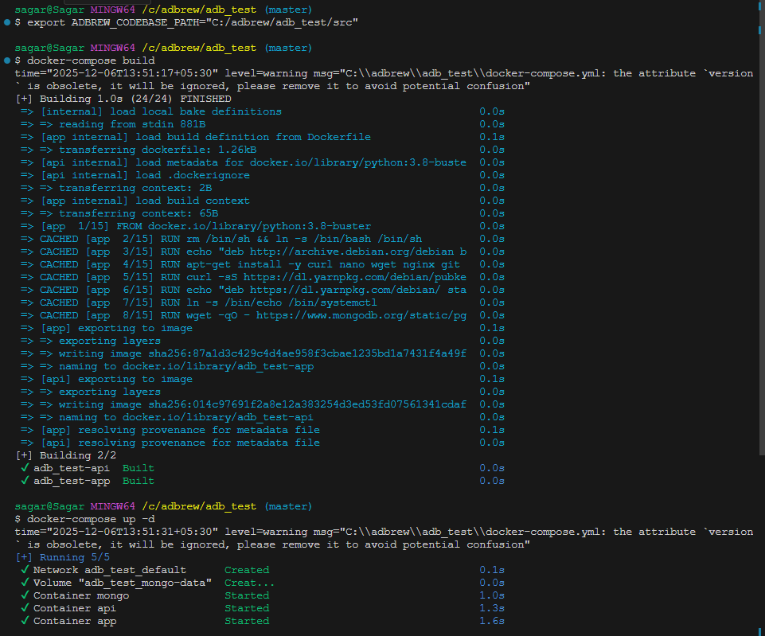
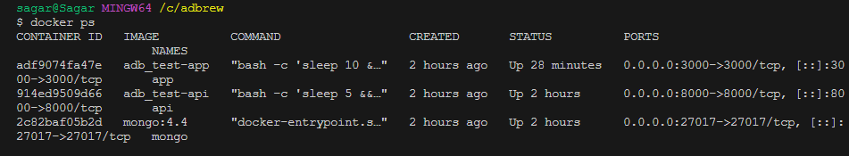
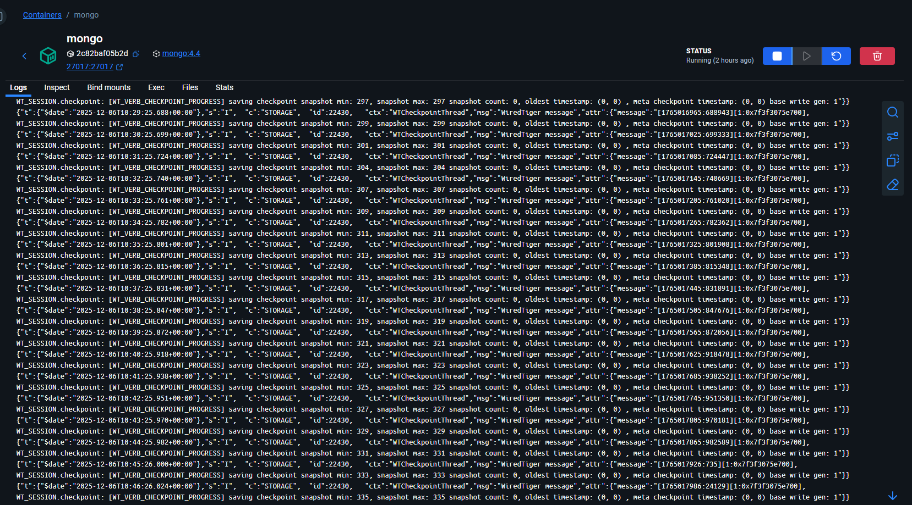
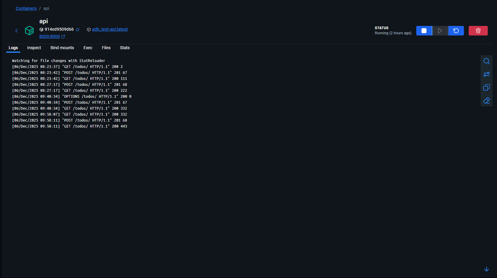
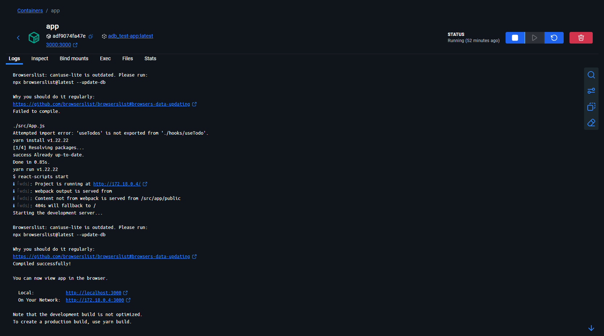
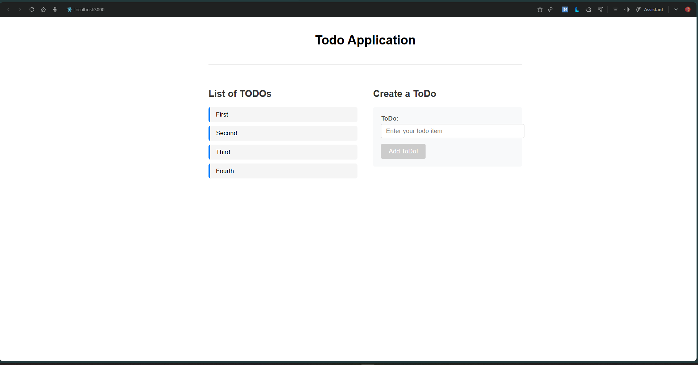

# Implementation Details

### 1. **Docker Setup**

Dockerfile

```bash
# set base image (host OS)
FROM python:3.8-buster

RUN rm /bin/sh && ln -s /bin/bash /bin/sh

RUN echo "deb http://archive.debian.org/debian buster main" > /etc/apt/sources.list && \
    echo "deb http://archive.debian.org/debian-security buster/updates main" >> /etc/apt/sources.list && \
    apt-get -y update
RUN apt-get install -y curl nano wget nginx git

RUN curl -sS https://dl.yarnpkg.com/debian/pubkey.gpg | apt-key add -
RUN echo "deb https://dl.yarnpkg.com/debian/ stable main" | tee /etc/apt/sources.list.d/yarn.list


# Mongo
RUN ln -s /bin/echo /bin/systemctl
RUN wget -qO - https://www.mongodb.org/static/pgp/server-4.4.asc | apt-key add -
RUN echo "deb http://repo.mongodb.org/apt/debian buster/mongodb-org/4.4 main" | tee /etc/apt/sources.list.d/mongodb-org-4.4.list
RUN apt-get -y update
RUN apt-get install -y mongodb-org

# Install Yarn
RUN apt-get install -y yarn

# Install PIP
RUN pip install --upgrade pip


ENV ENV_TYPE staging
ENV MONGO_HOST mongo
ENV MONGO_PORT 27017
##########

ENV PYTHONPATH=$PYTHONPATH:/src/

# copy the dependencies file to the working directory
COPY src/requirements.txt .

# install dependencies
RUN pip install -r requirements.txt

```

docker-compose.yml

```bash
version: "3"
services:
  api:
    build: .
    container_name: api
    command: bash -c "sleep 5 && cd /src/rest && python manage.py runserver 0.0.0.0:8000"
    ports:
      - "8000:8000"
    depends_on:
      - mongo
    volumes:
      - ${ADBREW_CODEBASE_PATH}:/src
      - ./tmp:/tmp

  app:
    build: .
    container_name: app
    command: bash -c "sleep 10 && cd /src/app && yarn install && yarn start"
    ports:
      - "3000:3000"
    depends_on:
      - api
    volumes:
      - ${ADBREW_CODEBASE_PATH}:/src

  mongo:
    image: mongo:4.4
    container_name: mongo
    restart: always
    ports:
      - "27017:27017"
    volumes:
      - mongo-data:/data/db # Changed from bind mount to named volume
    command: mongod --bind_ip 0.0.0.0

volumes:
  mongo-data: # Add this section at root level

```

### 2. **Setting up/ Commands execution**

Commands ran -



### 3. Docker Desktop





### 4. Challenges encountered

Refer **issues.md** to see what issues i have encountered when setting up the docker containers

### 5. Django view changes

```python
def get(self, request):
        try:
            todos = list(db.todos.find())
            for todo in todos:
                todo['_id'] = str(todo['_id'])
            return Response(todos, status=status.HTTP_200_OK)
        except Exception as e:
            logging.error(f"Error fetching todos: {str(e)}")
            return Response(
                {"error": "Failed to fetch todos"},
                status=status.HTTP_500_INTERNAL_SERVER_ERROR
            )

    def post(self, request):
        try:
            todo_description = request.data.get('todo_description', '').strip()
            if not todo_description:
                return Response(
                    {"error": "Todo text is required"},
                    status=status.HTTP_400_BAD_REQUEST
                )
            new_todo = {
                "text": todo_description,
                "completed": False,
                "created_at": datetime.now()
            }
            res = db.todos.insert_one(new_todo)
            created_todo = {
                '_id': str(res.inserted_id),
                'text': todo_description,
                'completed': False
            }
            return Response(created_todo, status=status.HTTP_201_CREATED)
        except Exception as e:
            logging.error(f"Error creating todo: {str(e)}")
            return Response(
                {"error": "Failed to create todo"},
                status=status.HTTP_500_INTERNAL_SERVER_ERROR
            )
```

### 6. React frontend changes

a) Created a new **useTodo** hook, that call the backend url (**http://localhost:8000/todos**) to **get** and **post** todos

```javascript
import { useState, useEffect } from "react";

const API_BASE_URL = process.env.REACT_APP_API_BASE_URL;

export const useTodo = () => {
  const [todos, setTodos] = useState([]);
  const [loading, setLoading] = useState(false);
  const [error, setError] = useState("");

  const fetchTodos = async () => {
    try {
      setLoading(true);
      const response = await fetch(`${API_BASE_URL}/todos/`);
      const data = await response.json();
      setTodos(data);
    } catch {
      setError("Failed to load todos.");
    } finally {
      setLoading(false);
    }
  };

  const createTodo = async (description) => {
    try {
      setLoading(true);
      await fetch(`${API_BASE_URL}/todos/`, {
        method: "POST",
        headers: { "Content-Type": "application/json" },
        body: JSON.stringify({ todo_description: description }),
      });
      fetchTodos();
    } catch {
      setError("Failed to create todo.");
    } finally {
      setLoading(false);
    }
  };

  useEffect(() => {
    fetchTodos();
  }, []);

  return {
    todos,
    loading,
    error,
    setError,
    createTodo,
  };
};
```

b) Used this customo hook in **App.js** \
c) Wrote some basic css in **App.css** to make it look good

### Output


